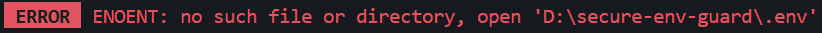
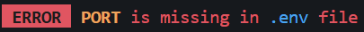
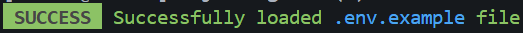

# secure-env-guard

A lightweight, type-safe environment variable validator for Node.js applications.

`secure-env-guard` ensures that required environment variables exist and match expected types before your application boots — preventing runtime failures caused by misconfiguration.

Designed for production-grade Node.js backends.

---

## Why secure-env-guard?

Misconfigured environment variables are one of the most common causes of production incidents.

This package enforces:

- Required variable presence
- Strict type validation (`string | number | boolean`)
- Early failure before server start
- Clean, developer-friendly, colorful CLI output
- Seamless dotenv integration

Fail fast. Fail clearly. Ship confidently.

---

## Installation

```bash
npm install secure-env-guard
```

---

## Links

- GitHub Repository:
  [https://github.com/Explore13/secure-env-guard](https://github.com/Explore13/secure-env-guard)

- NPM Package:
  [https://www.npmjs.com/package/secure-env-guard](https://www.npmjs.com/package/secure-env-guard)

---

## Basic Usage

```ts
import { validateEnv } from "secure-env-guard";

const env = validateEnv({
  PORT: "number",
  DEBUG: "boolean",
  API_KEY: "string",
};);

console.log(env.PORT); // number
console.log(env.DEBUG); // boolean
console.log(env.API_KEY); // string
```

### What Happens Here?

- `.env` is loaded automatically (via dotenv)
- Each key is validated
- Values are type-cast safely
- Application crashes immediately if validation fails

---

## Advanced Usage (Custom Config)

You can configure dotenv behavior manually.

### config.ts

```ts
import { validateEnv } from "secure-env-guard";

export const configureEnv = () => {
  try {
    const env = validateEnv(
      {
        PORT: "number",
        DB_URL: "string",
        DEV: "boolean",
      },
      {
        path: ".env.example", // custom env file
        load: true, // load using dotenv
      },
    );

    console.log("Environment variables validated successfully");
    return env;
  } catch (error) {
    console.error("Environment validation failed:", error);
    process.exit(1);
  }
};
```

---

### app.ts

```ts
import express from "express";
import { configureEnv } from "./config";

const app = express();
const env = configureEnv();

app.listen(env.PORT, () => {
  console.log(`Server running on port ${env.PORT}`);
});
```

---

## Type Safety

The returned object is fully inferred and strongly typed:

```ts
const env = validateEnv({
  PORT: "number",
  DEBUG: "boolean",
});
```

Now:

- `env.PORT` → number
- `env.DEBUG` → boolean

No manual parsing required.

---

## Options

```ts
validateEnv(schema, options?)
```

### Schema

```ts
{
  [key: string]: "string" | "number" | "boolean"
}
```

### Options

| Option | Type    | Default | Description            |
| ------ | ------- | ------- | ---------------------- |
| `path` | string  | `.env`  | Path to env file       |
| `load` | boolean | `true`  | Whether to load dotenv |

---

## ❌ Error Handling

The package fails fast with expressive CLI messages.

---

### 1️⃣ Environment File Not Found

If the specified `.env` file does not exist:



Example:

```
ERROR ENOENT: no such file or directory, open 'D:\secure-env-guard\.env'
```

---

### 2️⃣ Required Variable Missing

If a required variable is not present:



Example:

```
ERROR PORT is missing in .env file
```

---

### 3️⃣ Invalid Type

If a variable does not match expected type:


Example:

```
ERROR PORT must be a valid number
```

---

## ✅ Successful Load

When environment variables load successfully:



Example:

```
SUCCESS Successfully loaded .env.example file
```

---

## Production Recommendation

For production environments:

- Always validate before app bootstrap
- Use separate `.env.production`
- Crash the process on validation failure
- Never fallback silently

This package is designed to stop misconfigured deployments before they go live.

---

## Use Cases

- Express / Fastify backends
- Microservices
- CLI tools
- Next.js custom servers
- Dockerized apps
- CI/CD validation

---

## Philosophy

Configuration errors should never reach runtime.

`secure-env-guard` enforces configuration contracts at application start — similar to how TypeScript enforces types at compile time.

---

## License

MIT © Explore13

---
